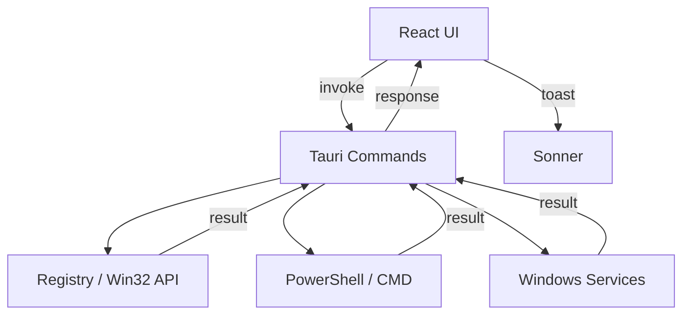
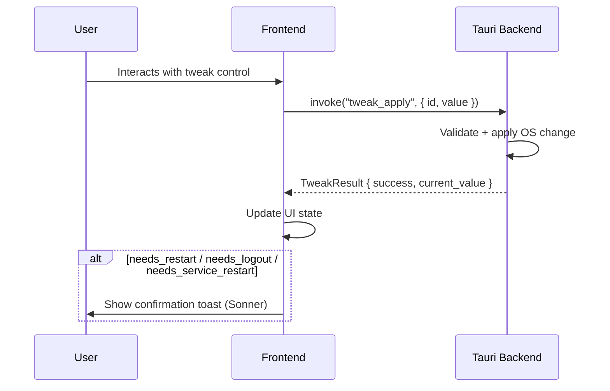
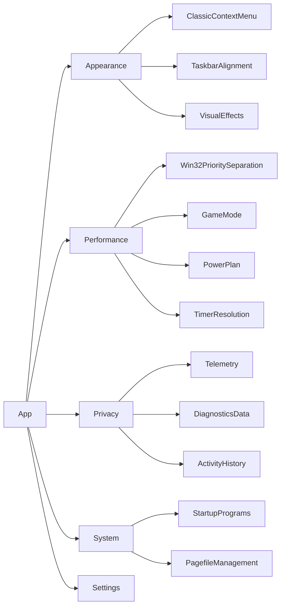
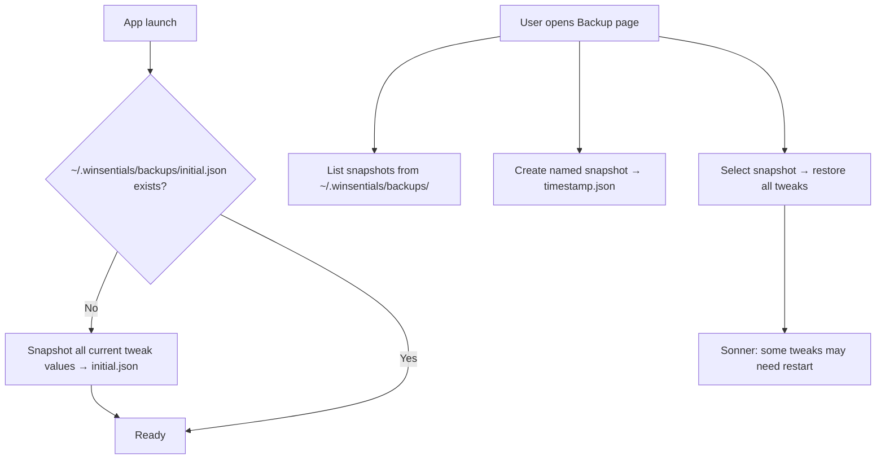

# AGENTS.md — Winsentials (Tauri + Bun + React + TypeScript)

> This document is the **single source of truth** for AI agents working on this project.
> Read it fully before touching any code. It will grow over time.

---

## Table of Contents

1. [Project Overview](#1-project-overview)
2. [Tech Stack](#2-tech-stack)
3. [Architecture](#3-architecture)
4. [Folder Structure](#4-folder-structure)
5. [Business Logic](#5-business-logic)
6. [Tweak System](#6-tweak-system)
7. [UI Layout & Components](#7-ui-layout--components)
8. [Theming & Visuals](#8-theming--visuals)
9. [i18n / Localization](#9-i18n--localization)
10. [MCP Tools — Instructions](#10-mcp-tools--instructions)
11. [Dependency & Runtime Rules](#11-dependency--runtime-rules)

---

## 1. Project Overview

**Winsentials** is a desktop application for Windows 10/11 that allows users to tune system settings across four primary domains:

- **Performance** — CPU scheduling, Game Mode, power plans, etc.
- **Privacy** — telemetry, data collection, diagnostics
- **Appearance** — context menus, taskbar, visual effects
- **System** — services, startup, miscellaneous OS behaviour

The app exposes a clean, friendly UI on top of low-level OS operations (registry edits, PowerShell commands, service control). Every tweak has a typed contract on both frontend and backend.

---

## 2. Tech Stack

| Layer | Technology |
|---|---|
| Desktop shell | Tauri v2 |
| Frontend runtime | Bun |
| Build tool | Vite |
| UI framework | React 19 |
| Language | TypeScript (strict) |
| Styling | TailwindCSS v4 |
| Component library | shadcn/ui |
| Routing | TanStack Router |
| State management | Zustand |
| i18n | i18next + react-i18next |
| Backend language | Rust (Tauri commands) |
| Window effects | `window-vibrancy` crate |
| Notifications | Sonner (toast) |

---

## 3. Architecture

### High-level flow



### Tweak lifecycle



### Backend command surface (per tweak)

Each tweak exposes exactly these Tauri commands:

```
tweak_apply        — apply a friendly value
tweak_reset        — revert to default
tweak_status       — get current friendly value + metadata flags
tweak_extra        — optional side-effect (show toast about restart, etc.)
```

### Backend command surface (global)

```
tweaks_by_category — return all TweakMeta for a given category
```

```rust
#[tauri::command]
pub fn tweaks_by_category(category: &str) -> Result<Vec<TweakMeta>, AppError> { ... }
```

This is the **only** way the frontend loads a category page. The page component calls `invoke("tweaks_by_category", { category: "appearance" })` on mount, gets back the full metadata list including current values, and renders the cards. No hardcoded tweak lists on the frontend.

---

## 4. Folder Structure

### Frontend — Feature-Sliced Design (FSD)

```
src/
├── app/                        # App-level providers, router root, global styles
│   ├── providers/
│   ├── styles/
│   └── router.tsx
│
├── pages/                      # Route-level page components
│   ├── appearance/
│   ├── performance/
│   ├── privacy/
│   ├── system/
│   ├── backup/                 # Backup / Restore page
│   └── settings/
│
├── widgets/                    # Composite UI blocks (sidebar, titlebar, tweak-list)
│   ├── sidebar/
│   ├── titlebar/
│   └── tweak-list/
│
├── features/                   # Scoped features (tweak-card, tweak-apply, theme-switcher)
│   ├── tweak-card/
│   ├── tweak-apply/
│   ├── backup-create/
│   ├── backup-restore/
│   ├── language-switcher/
│   └── theme-switcher/
│
├── entities/                   # Domain models (Tweak, Category, TweakValue)
│   ├── tweak/
│   │   ├── model/              # Types + Zustand store (useTweakStore)
│   │   └── api/                # Tauri invoke wrappers
│   └── backup/
│       ├── model/              # BackupMeta, RestoreReport types + Zustand store
│       └── api/                # Tauri invoke wrappers for backup_*
│
└── shared/                     # Pure utilities, UI primitives, i18n setup
    ├── ui/                     # Re-exported shadcn components
    ├── lib/                    # tauri.ts invoke helpers, cn(), etc.
    ├── i18n/                   # i18next config + locale files
    └── config/                 # App-wide constants
```

### Backend — Vertical Slice Design

```
src-tauri/
├── src/
│   ├── main.rs
│   ├── lib.rs                  # register_all_commands()
│   │
│   ├── tweaks/                 # One module per tweak domain
│   │   ├── mod.rs              # Tweak trait definition + registry map
│   │   ├── appearance/
│   │   │   ├── mod.rs
│   │   │   └── classic_context_menu.rs
│   │   ├── performance/
│   │   │   ├── mod.rs
│   │   │   ├── win32_priority_separation.rs
│   │   │   └── game_mode.rs
│   │   ├── privacy/
│   │   │   └── mod.rs
│   │   └── system/
│   │       └── mod.rs
│   │
│   ├── backup/                 # Backup / Restore slice
│   │   └── mod.rs              # backup_create, backup_list, backup_restore commands
│   │
│   ├── registry/               # Registry read/write helpers (RegKey helper)
│   │   └── mod.rs
│   ├── shell/                  # PowerShell / CMD execution helpers
│   │   └── mod.rs
│   └── error.rs                # Unified AppError type
│
└── Cargo.toml
```

---

## 5. Business Logic

### Category → Tweaks mapping



### Settings page (not a tweak page)

Settings manages app-level preferences only:

- Language selector (i18n)
- Theme selector (Light / Dark / Acrylic)

### Backup / Restore



**Storage location:** `~/.winsentials/backups/`

Each snapshot is a JSON file:

```json
{
  "created_at": "2025-01-15T10:30:00Z",
  "label": "initial",
  "tweaks": {
    "classic_context_menu": "enabled",
    "win32_priority_separation": "programs",
    "game_mode": "disabled"
  }
}
```

**Rules:**
- `initial.json` is created on **first launch only** and is **never overwritten** — it represents the pristine system state before any user changes
- On subsequent launches only existence of `initial.json` is checked; no write happens
- Manual snapshots use ISO timestamp as filename (e.g. `2025-01-15T10-30-00.json`)
- Restore calls `tweak_apply` for every tweak in the snapshot sequentially; errors are collected and shown in a summary toast, not thrown

**Tauri commands:**

```
backup_create(label: Option<String>) → Result<BackupMeta, AppError>
backup_list()                        → Result<Vec<BackupMeta>, AppError>
backup_restore(filename: String)     → Result<RestoreReport, AppError>
```

```rust
pub struct BackupMeta {
    pub filename: String,
    pub label: String,
    pub created_at: String,   // ISO 8601
}

pub struct RestoreReport {
    pub applied: u32,
    pub failed: Vec<String>,  // tweak ids that failed
}
```

---

## 6. Tweak System

### Tweak metadata contract (TypeScript)

```typescript
// entities/tweak/model/types.ts

export type RiskLevel = 'none' | 'low' | 'medium' | 'high'

export type RequiresAction
  = | { type: 'none' }
    | { type: 'logout' }
    | { type: 'restart_pc' }
    | { type: 'restart_service', serviceName: string }
    | { type: 'restart_app', appName: string }
    | { type: 'restart_device', deviceName: string }

export type TweakControlType
  = | { kind: 'toggle' }
    | { kind: 'radio', options: TweakOption[] }
    | { kind: 'dropdown', options: TweakOption[] }

export interface TweakOption {
  label: string // friendly label shown to user
  value: string // internal key sent to backend
}

export interface TweakMeta {
  id: string
  category: string
  name: string // i18n key
  shortDescription: string // i18n key — shown on card
  detailDescription: string // i18n key — shown in tooltip badge
  control: TweakControlType
  currentValue: string // friendly value (from backend)
  defaultValue: string // friendly value
  recommendedValue: string // friendly value
  risk: RiskLevel
  riskDescription?: string // i18n key — tooltip on risk badge; omit if risk === 'none'
  requiresAction: RequiresAction
  minOsBuild?: number // if set and current build < minOsBuild — card is locked
  // card shows: "Requires Windows build XXXXX (you have YYYYY)"
}
```

### Tweak backend contract (Rust)

```rust
// Each tweak module exposes the same 4 commands pattern:

#[tauri::command]
pub fn tweak_apply(id: &str, value: &str) -> Result<TweakResult, AppError> { ... }

#[tauri::command]
pub fn tweak_reset(id: &str) -> Result<TweakResult, AppError> { ... }

#[tauri::command]
pub fn tweak_status(id: &str) -> Result<TweakStatus, AppError> { ... }

#[tauri::command]
pub fn tweak_extra(id: &str) -> Result<(), AppError> { ... }
// tweak_extra is optional — use it to trigger side effects like
// showing a restart toast from the backend side if needed.
```

```rust
pub struct TweakResult {
    pub success: bool,
    pub current_value: String,   // friendly value after the change
}

pub struct TweakStatus {
    pub current_value: String,
    pub is_default: bool,
}

pub struct TweakMeta {
    pub id: String,
    pub category: String,
    pub min_os_build: Option<u32>,  // None = no restriction; Some(22621) = Win11 22H2+
    // ... mirrors the TypeScript TweakMeta fields
}
```

### Tweak trait (`tweaks/mod.rs`)

All tweak implementations **must** implement this trait. No ad-hoc logic outside of it.

```rust
// tweaks/mod.rs

pub trait Tweak: Send + Sync {
    fn id(&self) -> &str;
    fn meta(&self) -> &TweakMeta;
    fn apply(&self, value: &str) -> Result<(), AppError>;
    fn reset(&self) -> Result<(), AppError>;
    fn get_status(&self) -> Result<TweakStatus, AppError>;
    // extra() is optional — default impl is a no-op
    fn extra(&self) -> Result<(), AppError> { Ok(()) }
}
```

The global command handlers (`tweak_apply`, `tweak_reset`, etc.) resolve the correct `Box<dyn Tweak>` from a registry map keyed by tweak id, then dispatch to the trait method. No match/if-else chains per tweak in command handlers.

### Registry helper (`registry/mod.rs`)

```rust
// registry/mod.rs

pub enum Hive { CurrentUser, LocalMachine }

pub struct RegKey {
    hive: Hive,
    path: &'static str,
}

impl RegKey {
    pub fn open_read(&self) -> Result<winreg::RegKey, AppError> { ... }
    pub fn open_write(&self) -> Result<winreg::RegKey, AppError> { ... }
    pub fn get_dword(&self, name: &str) -> Result<u32, AppError> { ... }
    pub fn set_dword(&self, name: &str, value: u32) -> Result<(), AppError> { ... }
    pub fn get_string(&self, name: &str) -> Result<String, AppError> { ... }
    pub fn set_string(&self, name: &str, value: &str) -> Result<(), AppError> { ... }
    pub fn delete_value(&self, name: &str) -> Result<(), AppError> { ... }
}
```

Each tweak holds a `RegKey` constant and calls its methods — no raw `winreg` usage scattered across tweak files.

OS build number is read once at startup via this same helper:
`HKLM\SOFTWARE\Microsoft\Windows NT\CurrentVersion` → `CurrentBuild` (REG_SZ, parse to u32).
Stored in app state and compared against `TweakMeta.min_os_build` before rendering cards.

### Example tweaks

#### Classic Context Menu (Appearance)

| Field | Value |
|---|---|
| control | `toggle` |
| minOsBuild | `22000` (Win11 minimum) |
| risk | `none` |
| requiresAction | `restart_app` ("Explorer") |
| backend | sets/deletes `HKCU\Software\Classes\CLSID\{86ca...}\InprocServer32` |

#### Win32PrioritySeparation (Performance)

| Field | Value |
|---|---|
| control | `radio` with options: `Programs` / `Background Services` / `Games (Optimal)` |
| minOsBuild | — |
| risk | `low` |
| requiresAction | `restart_pc` |
| backend | writes DWORD to `HKLM\SYSTEM\CurrentControlSet\Control\PriorityControl\Win32PrioritySeparation` |

#### Game Mode (Performance)

| Field | Value |
|---|---|
| control | `toggle` |
| minOsBuild | — |
| risk | `none` |
| requiresAction | `none` |
| backend | writes `GameMode` DWORD under `HKCU\Software\Microsoft\GameBar` |

---

## 7. Toast confirmation (Sonner)

Shown **after** the user interacts with a control that has `requiresAction !== 'none'`:

```
"This tweak requires restarting Explorer. Restart now?"
[Restart]  [Later]
```

---

## 8. Theming & Visuals

Three themes available app-wide:

| Theme | Description |
|---|---|
| `light` | Standard light mode |
| `dark` | Standard dark mode |
| `acrylic` | Dark base + acrylic/blur via `window-vibrancy` crate |

### TailwindCSS v4 notes

- **No `tailwind.config.js`** — configuration lives in CSS via `@theme` block in the main CSS file
- Dark mode variant: use `@variant dark` in CSS or the `dark:` prefix in markup — configured via `@custom-variant dark (&:where([data-theme=dark], [data-theme=dark] *))`
- Acrylic theme is a third variant: `@custom-variant acrylic (&:where([data-theme=acrylic], [data-theme=acrylic] *))`
- CSS variables for transparency (acrylic) are defined inside the `@theme` block
- Do **not** use `darkMode: 'class'` config — that's v3 syntax and will be ignored in v4

---

## 9. i18n / Localization

- Library: `i18next` + `react-i18next`
- Config location: `src/shared/i18n/`
- Locale files: `src/shared/i18n/locales/{lang}.json`
- Initial languages: `en`, `ru`
- Language is selected in the Settings page and persisted in app config
- All user-visible strings (tweak names, descriptions, UI labels) must use i18n keys — **no hardcoded strings in components**
- Tweak metadata fields that are i18n keys: `name`, `shortDescription`, `detailDescription`, `riskDescription`

---

## 10. MCP Tools — Instructions

> AI agents **must** follow these rules on when and how to use each MCP tool.
> Do not skip MCP usage when the task involves external knowledge.

### Context7 — Deep documentation search

**Use when:**
- Looking up API details for any library in the tech stack (Tauri, i18next, TanStack Router, shadcn, window-vibrancy, etc.)
- Finding correct function signatures, config options, or crate APIs
- Verifying behaviour that might differ between versions

**How to use:**
1. First call `resolve-library-id` with the library name to get the Context7 ID
2. Then call `get-library-docs` with that ID and a specific topic query
3. Always prefer Context7 over your own memory for library APIs — your training data may be stale

**Do NOT use for:** general web news, OS-level Windows API docs (use Exa instead)

---

### Exa — General internet search

**Use when:**
- Context7 doesn't have the library or returns insufficient results
- Searching for Windows registry keys, Win32 API behaviour, OS-level documentation
- Looking up known issues, community solutions, or GitHub issues

**How to use:**
- Use specific search queries (e.g. `"Win32PrioritySeparation registry values windows 11"`)
- Prefer official Microsoft docs URLs when available in results
- Use as fallback, not primary — always try Context7 first for library docs

---

### Shadcn MCP — Component management

**Use when:**
- Adding a new shadcn/ui component to the project
- Checking available component variants or props

**How to use:**
- **Before building any UI component from scratch** — always check shadcn first via the MCP tool. If the component exists there, use it. Never reinvent what shadcn already has.
- Use the shadcn MCP tool to search and add components — do **not** manually copy-paste component code
- After adding, import from `@/shared/ui/` (re-export layer), not directly from `@/shared/ui/<component>`
- `components.json` aliases are already remapped to FSD paths — shadcn will drop files into the correct locations automatically:

| shadcn alias | resolves to |
|---|---|
| `ui` | `src/shared/ui` |
| `lib` | `src/shared/lib` |
| `utils` | `src/shared/lib/utils` |
| `hooks` | `src/shared/lib/hooks` |

**Do NOT use for:** styling questions, Tailwind utilities, non-shadcn components

---

## 11. Dependency & Runtime Rules

### Frontend

- **Runtime:** `bun` only. Never use `npm`, `pnpm`, `node` directly.
- Install packages: `bun add <pkg>`
- Dev packages: `bun add -d <pkg>`
- Run scripts: `bunx <tool>` or `bun run <script>`
- Do **not** commit `package-lock.json` or `pnpm-lock.yaml` — only `bun.lockb`

### Backend (Rust)

- Add dependencies: `cargo add <crate>` — never manually edit `Cargo.toml` version strings
- When adding a crate with features: `cargo add <crate> --features <feat1>,<feat2>`
- After adding deps, always run `cargo check` to verify the build compiles

### Tauri

- Use Tauri v2 APIs — do not use v1 patterns (different plugin system, command registration, etc.)
- Register all commands in `lib.rs` via `tauri::Builder::default().invoke_handler(tauri::generate_handler![...])`
- Use `tauri::command` macro on all public Rust handlers

---

## 12. Post-Task Checks

Run these after **every** completed task before considering it done. Do not skip even for "small" changes.

### Frontend

Order matters — format first so typecheck sees clean code:

```bash
# 1. Fix formatting and lint errors
bun run format
# fallback if script not available:
bunx eslint --fix .

# 2. Type check — must pass with zero errors
bun run typecheck
# fallback:
bunx tsc --noEmit
```

> `eslint-stylistic` is used for formatting — it replaces Prettier. `bun run format` runs `eslint --fix`, not a separate formatter.

### Backend

Order matters — fmt before clippy so clippy sees formatted code; check after clippy fix to confirm the build is clean:

```bash
# 1. Format
cargo fmt

# 2. Lint + auto-fix what's fixable
cargo clippy --fix --allow-dirty --allow-staged

# 3. Verify the build compiles cleanly
cargo check
```

> If `cargo clippy --fix` introduces new warnings/errors that can't be auto-fixed, resolve them manually before `cargo check`.

### Pass criteria

A task is only **done** when:
- `bun run typecheck` exits with code `0`
- `bun run format` produces no unfixable errors
- `cargo check` exits with code `0`
- `cargo clippy` reports no warnings (or they are explicitly `#[allow(...)]`-ed with a comment explaining why)
