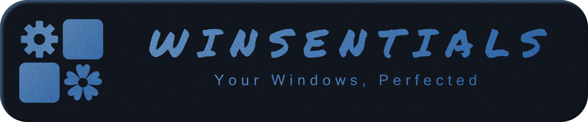

<div align="center">
  
  <p align="center">
    <a href="https://github.com/Noktomezo/Winsentials/releases"><picture><source media="(prefers-color-scheme: dark)" srcset="https://www.shieldcn.dev/github/release/Noktomezo/Winsentials.svg?size=sm&amp;mode=dark&amp;theme=slate"></picture></a>
    <a href="https://github.com/Noktomezo/Winsentials/actions"><picture><source media="(prefers-color-scheme: dark)" srcset="https://www.shieldcn.dev/github/ci/Noktomezo/Winsentials.svg?variant=secondary&amp;size=sm&amp;mode=dark&amp;theme=slate"></picture></a>
    <a href="https://github.com/Noktomezo/Winsentials/stargazers"><picture><source media="(prefers-color-scheme: dark)" srcset="https://www.shieldcn.dev/github/stars/Noktomezo/Winsentials.svg?variant=secondary&amp;size=sm&amp;mode=dark&amp;theme=slate"></picture></a>
    <a href="https://github.com/Noktomezo/Winsentials/commits/main"><picture><source media="(prefers-color-scheme: dark)" srcset="https://www.shieldcn.dev/github/last-commit/Noktomezo/Winsentials.svg?variant=secondary&amp;size=sm&amp;mode=dark&amp;theme=slate"></picture></a>
  </p>

  <p align="center">
    <strong>Winsentials</strong> is an ultra-fast, modern system utility for Windows 10 &amp; 11 engineered in <strong>pure Rust and GPUI</strong>.<br/>
    Fine-tune performance, minimize input latency, declutter the OS, and monitor hardware in real time — with zero WebView overhead and buttery 240+ FPS responsiveness.
  </p>
</div>

## ⚡ Features

🦀 **Pure Rust & GPUI** — Zero Electron or WebView overhead. Direct GPU-accelerated rendering at native display refresh rates.<br/>
⏱️ **Lightweight & Instant** — Near-instant cold start with negligible memory footprint.<br/>
🎮 **Gaming & Input Latency** — Directional SOCD neutralization (SnapKey), low-latency pointer control, and kernel I/O scheduling.<br/>
📊 **Real-Time Telemetry** — Stepped history graphs and live metrics for CPU (per-core load), GPU (engines & VRAM), disk I/O, and network.<br/>
🛠️ **System & Shell Tuning** — Windows 10/11 shell decluttering, context menu restoration, and low-level network optimization.<br/>
🧹 **Disk Cleanup** — Fast scanner for crash dumps, temporary files, and system caches with accurate space reclamation.<br/>
🚀 **Startup Manager** — Unified inspection and control of autoruns, background services, and scheduled tasks.<br/>
🔄 **Integrated Auto-Updater** — Background release checks with in-toast download progress and seamless updates.

## 📥 Installation

- **Installer (Recommended)**: Download `winsentials-win-x64-setup.exe` from the latest [GitHub Release](https://github.com/Noktomezo/Winsentials/releases) for automatic desktop integration and clean uninstallation.
- **Portable**: Download `winsentials-win-x64-portable.zip`, extract anywhere, and run `Winsentials.exe`.

## 🛠️ Building From Source

### Prerequisites
- [Rust](https://rustup.rs) 1.85+ (Edition 2024)
- Visual Studio 2022 C++ Build Tools
- [just](https://github.com/casey/just) command runner (`cargo install just`)

### Build & Run

```bash
git clone https://github.com/Noktomezo/Winsentials.git
cd Winsentials

# Run debug build
just run

# Build release artifacts (installer & portable zip)
just build
```

## ⌨️ Keyboard Shortcuts

| Shortcut | Action |
| :--- | :--- |
| <kbd>Ctrl</kbd> + <kbd>F</kbd> / <kbd>/</kbd> | Focus search in Startup / Tweaks |
| <kbd>Escape</kbd> | Close active dropdown, clear search, or navigate back |
| <kbd>Ctrl</kbd> + <kbd>Q</kbd> | Quit application |

&nbsp;

<div align="center">
  
  <p>Made with 💜. Published under <a href="LICENSE">MIT license</a>.</p>
</div>

