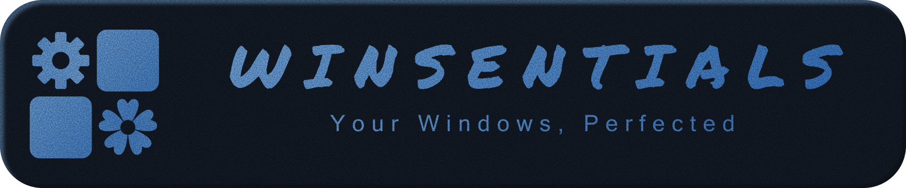

<div align="center">
  
  <p align="center">
    <picture><source media="(prefers-color-scheme: dark)" srcset="https://www.shieldcn.dev/github/stars/Noktomezo/Winsentials.svg?variant=secondary&amp;size=xs&amp;mode=dark"></picture>
    <picture><source media="(prefers-color-scheme: dark)" srcset="https://www.shieldcn.dev/github/last-commit/Noktomezo/Winsentials.svg?variant=secondary&amp;size=xs&amp;mode=dark"></picture>
    <picture><source media="(prefers-color-scheme: dark)" srcset="https://www.shieldcn.dev/github/commits/Noktomezo/Winsentials.svg?variant=secondary&amp;size=xs&amp;mode=dark"></picture>
    <picture><source media="(prefers-color-scheme: dark)" srcset="https://www.shieldcn.dev/github/release/Noktomezo/Winsentials.svg?size=xs&amp;mode=dark"></picture>
    <picture><source media="(prefers-color-scheme: dark)" srcset="https://www.shieldcn.dev/github/ci/Noktomezo/Winsentials.svg?variant=secondary&amp;size=xs&amp;mode=dark"></picture>
    <picture><source media="(prefers-color-scheme: dark)" srcset="https://www.shieldcn.dev/github/license/Noktomezo/Winsentials.svg?variant=ghost&amp;size=xs&amp;mode=dark"></picture>
  </p>

  <p align="center">
    <strong>Winsentials</strong> is an ultra-fast, modern system utility for Windows 10 &amp; 11.<br/>
    Fine-tune performance, minimize input latency, declutter the OS, and monitor hardware in real time.
  </p>
</div>

## 📸 Preview Screenshots
<div align="center" style="display: flex; flex-direction: row">
  
  
  
  
</div>

## 📥 Installation

- **Installer (Recommended)**: Download `winsentials-win-x64-setup.exe` from the latest [GitHub Release](https://github.com/Noktomezo/Winsentials/releases) for automatic desktop integration and clean uninstallation.
- **Portable**: Download `winsentials-win-x64-portable.zip`, extract anywhere, and run `Winsentials.exe`.

## 🛠️ Building From Source

### Prerequisites
- [Rust](https://rustup.rs) 1.85+ (Edition 2024)
- Visual Studio 2022 C++ Build Tools
- [just](https://github.com/casey/just) command runner (`cargo install just`)

### Build & Run

```bash
git clone https://github.com/Noktomezo/Winsentials.git
cd Winsentials

# Run debug build
just run

# Build release artifacts (installer & portable zip)
just build
```

<div align="center">
  
  <p>Made with 💜. Published under <a href="LICENSE">MIT license</a>.</p>
</div>

